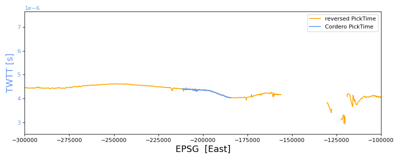

nasa_combined
==============================

<!--  -->

Tools for aerogeophyiscal data over ice shelves
--------
Primarily OIB and ROSETTA.

--------

<small>Project based on the <a target="_blank" href="https://github.com/jbusecke/cookiecutter-science-project">cookiecutter science project template</a>.</small>

